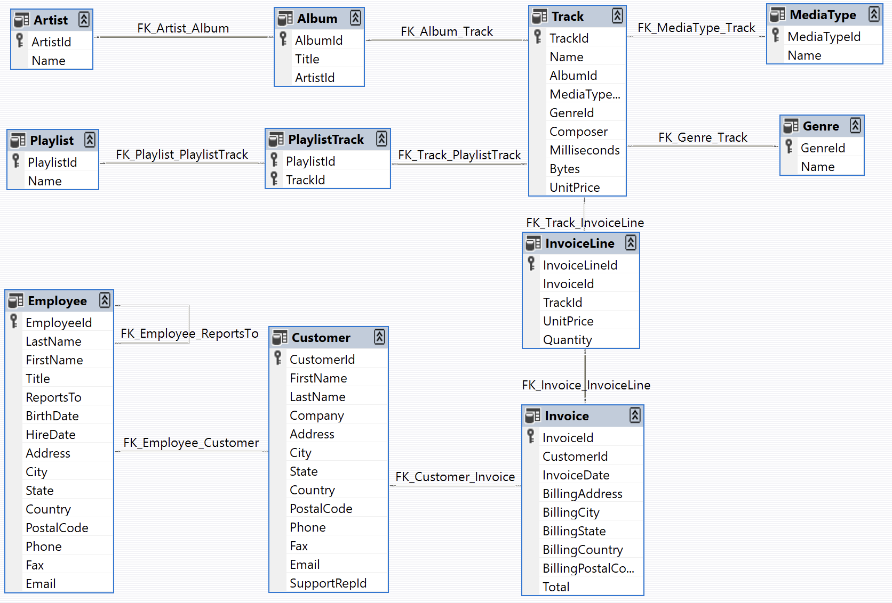

  <a href="#en">🇬🇧 English</a> · 
  <a href="#fr">🇫🇷 français</a>

# Exigences d'InfraMusicStore

Développer une API pour un magasin de disques en ligne, avec une pile entièrement conteneurisée

## Introduction

Développer l'API de gestion d'un magasin de disques en ligne dans un environnement Docker complet.

## Contexte professionnel

Nous sommes une équipe de 3 développeurs étudiants ; Leila Wilde, Louis Cordier & Mathieu Auger.

Nous rejoignons l'équipe numérique du magasin **InfraMusicStore**, qui distribuera la musique en ligne et promouvra les artistes.

Nous avons une formation en développement logiciel en C, Java, C++, Python, SQL. Nous pouvons choisir comment développer le projet avec la méthodologie que nous préférons.

On nous a demandé d'implémenter une solution API en commençant par construire une base de données qui sera structurée comme la base de données Chinook [disponible en ligne](https://github.com/lerocha/chinook-database).

## Étapes du projet

Nous ne construisons pas un site Web de gestion complet, mais simplement **la mise en place d'une API REST qui permet d'accéder aux données de notre base de données relationnelle de style Chinook**, avec des capacités de lecture/écriture : toutes les opérations CRUD doivent être supportées.

Nous devons déployer une API rendant nos données de base de données disponibles, dans un environnement entièrement dockerisé, et qui utilise un **pipeline CI/CD automatisé**.

### Étape 1 : la base de données

Nous devons configurer une **base de données relationnelle avec plusieurs tables interconnectées** : artistes, albums, pistes, genres... ces tables sont fournies dans le référentiel Chinook. Nous devons les importer dans notre système et nous assurer que les connexions sont correctement établies.

Les attentes sont les suivantes :

- définition claire des **relations et clés étrangères**,
- fourniture de scripts d'initialisation SQL (DDL),
- utilisation d'un moteur de base de données relationnelle Open Source comme **MySQL**.
- les tables doivent être correctement **normalisées**.
- doit intégrer des données de test qui ne figurent pas dans les tables de base (au moins 20 entrées pour 4 tables). Ces données doivent être ajoutées **par programmation** : pas d'ajouts manuels via une interface graphique !
    - Nous pouvons nous inspirer d'un ensemble de données [fourni](https://github.com/lerocha/chinook-database/releases) en JSON ou SQL avec le référentiel Chinook.
    - Nous pouvons utiliser ces exemples comme inspiration pour intégrer nos données de test.

### Étape 2 : API REST

L'application doit exposer une **API REST complète**, connectée à la base de données via des **variables d'environnement**.

Les points de terminaison minimums attendus sont ceux d'un CRUD. Par exemple, pour les pistes :

- **GET** /api/tracks — toutes les pistes
- **GET** /api/tracks/:id — détails des pistes
- **POST** /api/tracks — crée une piste
- **PUT** /api/tracks/:id — modifie une piste
- **DELETE** /api/tracks/:id — supprime une piste.

Ce modèle doit s'appliquer à **au moins 4 ressources**.

Autres exigences :

- toutes les réponses doivent être au format **JSON**.
- facultatif : implémentation d'un **système d'authentification** : le client de l'API doit être authentifié, via le système de notre choix (simplifiez-le !). Si le client n'est pas authentifié, notre API doit retourner **le code HTTP correct**.
- nous devons gérer correctement les **erreurs HTTP de base** (403, 404, 500, etc.).
- pour notre API, nous pouvons utiliser Go-Fiber
- facultatif : gestion de la **pagination**, des **filtres**, du **tri**.

### Étape 3 : architecture Docker

Une fois notre API fonctionnelle, nous pouvons commencer la conteneurisation. L'environnement de notre application doit être entièrement conteneurisé avec **Docker**. Nous devons utiliser **Docker Compose** avec au moins **trois services distincts** :

1. L'**application principale** (notre API)
2. La **base de données**
3. Un outil d'administration de base de données (Adminer, phpMyAdmin, etc.)
4. (facultatif) Swagger UI pour la documentation interactive de l'API.

Les points suivants doivent être présents :

- un **Dockerfile** spécifique à l'API,
- une configuration **Docker Compose** complète avec les trois services,
- gestion appropriée des **réseaux Docker** pour la communication entre les conteneurs,
- facultatif : configuration des **volumes** pour assurer la **persistance des données** pour la base de données

### Étape 4 : pipeline GIT + CI/CD

Une fois notre application entièrement dockerisée, nous devons mettre en place une véritable **intégration continue** pour notre projet. Le déploiement de notre application doit se faire automatiquement !

Le contrôle de version doit être géré via **GitHub** :

- nous devons utiliser le système des **Pull Requests**,
- nous devons implémenter un **flux de travail GitHub Actions** permettant le **déploiement automatique** de notre projet.

### Étape 5 : documentation Swagger

Nous devrons fournir une documentation complète de notre API sous la forme d'un fichier swagger.yml ou swagger.json. Ce fichier doit :

- documenter **tous les points de terminaison de l'API**,
- inclure des **exemples de requêtes et de réponses**,
- présenter les **schémas de notre modèle de données**,
- être accessible à partir d'un point de terminaison comme http://localhost:8080/docs via **Swagger UI**.

### Étape 6 : documentation du projet

Enfin, nous devons documenter complètement notre projet à l'aide de fichiers de développement standard.

En particulier, nous devons avoir un fichier README.md avec :

- l'architecture du projet,
- les instructions d'installation,
- quelques commandes Docker utiles,
- optionnellement, le schéma de la base de données,
- les URL des services de notre application

Nous fournirons également un fichier .env.example pour les variables.

## Compétences visées

- bases de données relationnelles
- API REST
- Docker & Docker Compose
- CI/CD
- Swagger

## Rendu

Le projet sera soumis sur github :
https://github.com/leila-wilde/btp-projet-container

## Ressources

- [Swagger](https://en.wikipedia.org/wiki/Swagger_(software))

  <a href="#en">🇬🇧 English</a> · 
  <a href="#fr">🇫🇷 français</a>

# InfraMusicStore requirements 

Develop an API for an online record store, with a fully containerized stack

## Introduction

Develop the management API for an online record store in a complete Docker environment. 

## Professional context

We are a team of 3 student developers; Leila Wilde, Louis Cordier & Mathieu Auger. 

We are joining the digital team of the **InfraMusicStore** store, which will distribute music online and promote artists.

We have a software development background in C, Java, C++, Python, SQL. We can choose how to develop the project with the methodology we prefer.

We have been asked to implement an API solution by first building a database that will be structured like the Chinook database [available online](https://github.com/lerocha/chinook-database).

## Project steps

We are not building a complete management website, but simply **setting up a REST API that allows access to our Chinook style relational database data**, with read/write capabilities: all CRUD operations must be supported.

We need to deploy an API making our database data available, in a fully dockerized environment, and that uses an **automated CI/CD pipeline**.

### Step 1: the database

We must set up a **relational database with multiple interconnected tables**: artists, albums, tracks, genres... these tables are provided in the Chinook repository. We must import them into our system and ensure that the connections are properly made.

The expectations are as follows:

- Clear definition of **relationships and foreign keys**,
- Provision of SQL initialization scripts (DDL),
- Use of Open Source relational database engine like **MySQL**.
- tables must be properly **normalized**.
- Must integrate test data that is not in the base tables (at least 20 entries for 4 tables). This data must be added **programmatically**: no manual additions via a GUI!
    - We can be inspired by a dataset [provided](https://github.com/lerocha/chinook-database/releases) in JSON or SQL with the Chinook repository.
    - We can use these examples as inspiration to integrate our test data.

### Step 2: REST API

The application must expose a **complete REST API**, connected to the database via **environment variables**.

The minimum expected endpoints are those of a CRUD. For example, for tracks:

- **GET** /api/tracks — all tracks
- **GET** /api/tracks/:id — track details
- **POST** /api/tracks — creates a track
- **PUT** /api/tracks/:id — modifies a track
- **DELETE** /api/tracks/:id — deletes a track.

This pattern should apply to **at least 4 resources**.

Other requirements:

- all responses must be in **JSON** format.
- optional: implementation of an **authentication system**: the API client must be authenticated, via the system of our choice (keep it simple!). If the client is not authenticated, our API must return **the correct HTTP code**.
- we must properly handle **basic HTTP errors** (403, 404, 500, etc.).
- for our API we can use Go-Fiber
- optional: management of **pagination**, **filters**, **sorting**.

### Step 3: Docker architecture

Once our API is functional, we can begin containerization. Our application's environment must be fully containerized with **Docker**. We must use **Docker Compose** with at least **three distinct services**:

1. The **main application** (our API)
2. The **database**
3. A database administration tool (Adminer, phpMyAdmin, etc.)
4. (optional) Swagger UI for interactive API documentation.

The following points must be present:

- A **Dockerfile** specific to the API,
- A complete **Docker Compose** configuration with the three services,
- Proper management of **Docker networks** for communication between containers,
- Optional: configuration of **volumes** to ensure **data persistence** for the database

### Step 4: GIT Pipeline + CI/CD

Once our application is fully dockerized, we must set up real **continuous integration** for our project. Our application deployment must happen automatically!

Version control must be managed via **GitHub**:

- We must use the **Pull Requests** system,
- We must implement a **GitHub Actions workflow** enabling **automatic deployment** of our project.

### Step 5: Swagger documentation

We will need to provide complete documentation of our API in the form of a swagger.yml or swagger.json file. This file must:

- document **all API endpoints**,
- include **examples of requests and responses**,
- present the **schemas of our data model**,
- be accessible from an endpoint like http://localhost:8080/docs via **Swagger UI**.

### Step 6: Project documentation

Finally, we must fully document our project using standard development files.

In particular, we must have a README.md file with:

- the project architecture,
- installation instructions,
- some useful Docker commands,
- optionally, the database schema,
- the URLs of our application services

We will also provide a .env.example file for variables.

## Targeted skills

- relational databases
- REST API
- Docker & Docker Compose
- CI/CD
- Swagger

## Submission

The project will be submitted on github:
https://github.com/leila-wilde/btp-projet-container

## Resources

- [Swagger](https://en.wikipedia.org/wiki/Swagger_(software))
